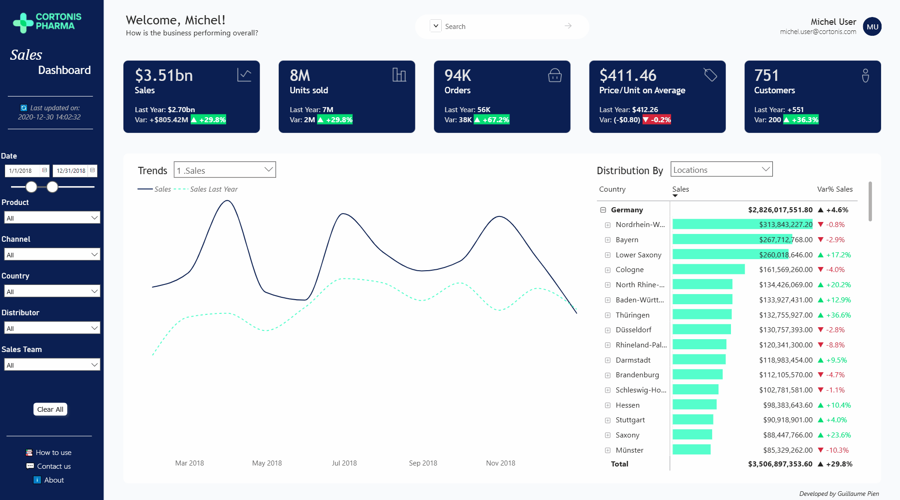
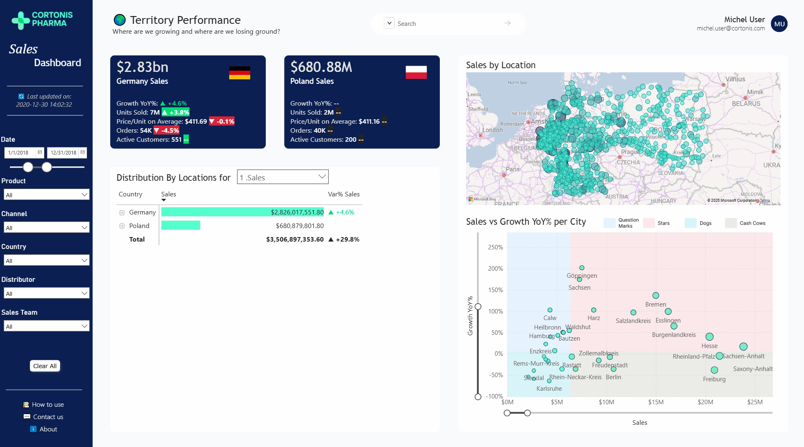
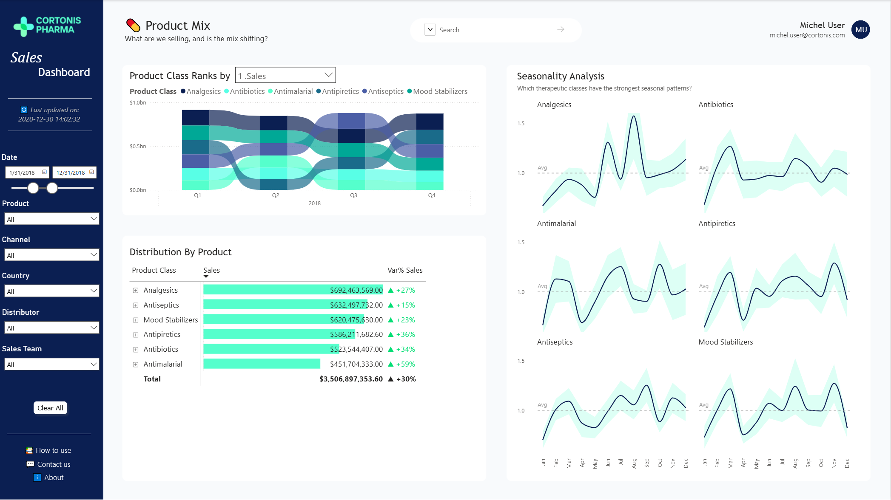
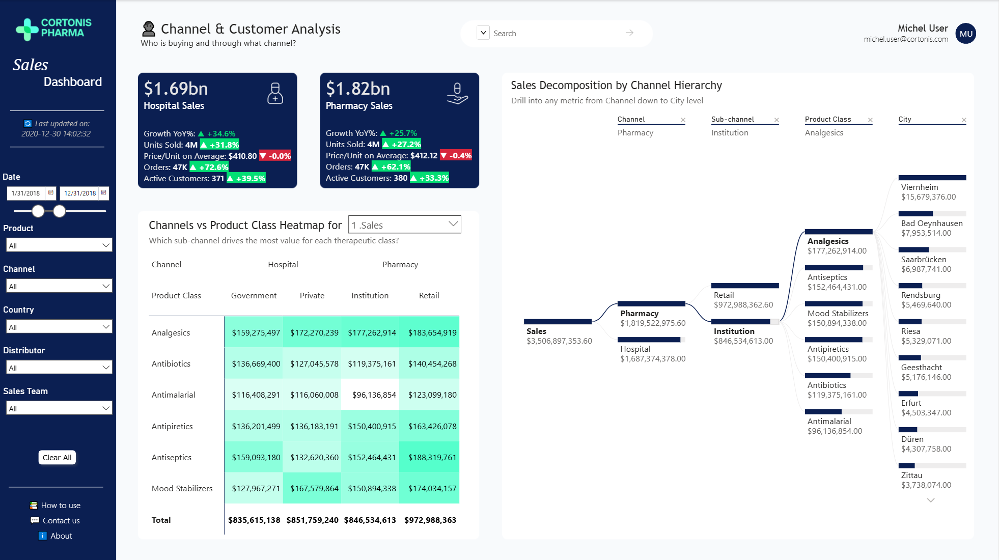
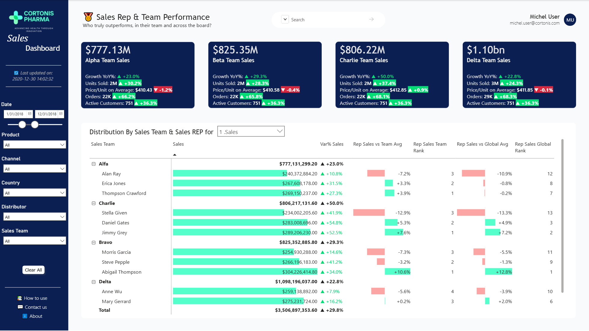

# 💊 Cortonis Pharma - Sales Performance Dashboard


> A commercial performance dashboard for a fictional pharmaceutical company - built to answer the questions a sales manager actually asks, with a UX-first approach from Figma wireframe to deployed report.

---

## The Context

**Cortonis Pharma** is a fictional pharmaceutical company operating across Poland and Germany. The dataset covers 254,000 sales transactions across 4 years (2017–2020), including product-level detail, customer and distributor information, channel breakdown, geographic data, and sales team hierarchy.

The dashboard is designed for two audiences:
- **Sales leadership** - executive overview, trend monitoring, high-level KPIs
- **Territory and field managers** - granular performance by rep, territory, product, and channel

---

## Data Source

**Foresight - Pharmaceutical Manufacturing Company's Wholesale-Retail Data**
254,082 transactions · Poland & Germany · 2017–2020

| Field | Description |
|-------|-------------|
| `Distributor` | Wholesaler name |
| `Customer Name` | Pharmacy or hospital name |
| `City` / `Country` | Customer location |
| `Channel` | Hospital or Pharmacy |
| `Sub-channel` | Private, Retail, Institution, Government |
| `Product Name` | Drug name |
| `Product Class` | Therapeutic class (Antibiotics, Analgesics, Mood Stabilizers, Antiseptics, Antipyretics, Antimalarial) |
| `Quantity` / `Price` / `Sales` | Transaction volume and value |
| `Month` / `Year` | Transaction period |
| `Name of Sales Rep` | Rep who facilitated the sale |
| `Manager` / `Sales Team` | Team hierarchy (Alfa, Bravo, Charlie, Delta) |

> Note on Poland data: sales data for Poland is available for 2018 only. YoY variance indicators are intentionally hidden for Poland to avoid misleading comparisons.

---

## Page 1 - Executive Overview

### What it answers
- How is the business performing overall - in sales, volume, orders, pricing, and customer count?
- Is performance improving or declining vs. the previous year?
- What does the sales trend look like across the year, and how does it vary by quarter?
- Which territories, products, channels, or teams are driving the most value?

### Screenshot



### KPI Cards

Five top-level metrics, each showing the current period value alongside both the previous year's absolute value and the variance in absolute and percentage terms (color-coded green/red):

| KPI | Description |
|-----|-------------|
| **Sales** | Total revenue for the selected period |
| **Units Sold** | Total quantity sold |
| **Orders** | Number of distinct transactions |
| **Price / Unit on Average** | Average selling price per unit |
| **Customers** | Number of distinct active customers |

Each card displays: current value · last year value · absolute variance · % variance. Showing both absolute and relative variance is a deliberate choice - on billion-dollar figures, a "-16%" means more when paired with "-$575.96M". YoY variance adapts automatically to the selected period using `PARALLELPERIOD` DAX logic.

### Trend Chart - Current Year vs. Last Year + Field Parameter (Metric)

The chart overlays two series simultaneously - current period and same period last year - making period-over-period trends immediately visible without any additional interaction. A dropdown field parameter lets the user switch the displayed metric across all five KPIs:

```
Sales → Units Sold → Orders → Price/Unit → Customers
```

Switching the metric updates both the trend chart and the distribution matrix simultaneously - a single selection drives the entire page.

### Distribution Matrix - Dual Field Parameters

The matrix on the right provides a ranked breakdown of the selected metric. It uses **two independent field parameters**:

**Parameter 1 - Metric** (shared with the trend chart)
Switches the value column between Sales, Units Sold, Orders, Price/Unit, and Customers.

**Parameter 2 - Dimension**
A dropdown switches the breakdown axis between:
- Locations (Country → Region)
- Product Class → Product
- Channel → Sub-channel
- Sales Team → Sales Rep

The matrix displays three columns: the absolute value, a data bar for visual ranking, and a **Var% vs. Last Year** column - color-coded green/red - so performance context is visible directly in the breakdown without needing a separate visual.

This dual-parameter architecture means the user can explore any metric across any dimension from a single page - without navigating away or duplicating report pages.

### Search Bar

A cross-dimension search bar filters the entire page by matching against a concatenated column that combines Channel, Sub-channel, Country, City, Product Class, Product Name, Sales Team, and Manager into a single searchable string per row.

### Slicers

Six synchronized slicers on the left sidebar filter all visuals simultaneously:

`Date` · `Product` · `Channel` · `Country` · `Distributor` · `Sales Team`

A **Clear All** button resets all slicers via a named bookmark - one click returns the page to its default state.

### UX Details

- **Personalized greeting** - `USERPRINCIPALNAME()` renders the logged-in user's name and email in the top-right header
- **Date range slicer** - a dual-handle slider with explicit start/end dates gives precise period control
- **Last updated timestamp** - displayed in the sidebar for data governance transparency
- **Help links** - sidebar footer includes How to use, Contact us, and About
- **Custom navigation** - page navigation via buttons rather than native Power BI tabs
- **Tooltip pages** - hovering over KPI cards and chart data points surfaces a custom tooltip page with contextual detail
- **Author signature** - "Developed by Guillaume Pien" displayed in the report footer

---

## Page 2 - Territory & Geographic Performance

### What it answers
- Where are we growing and where are we losing ground?
- How do Germany and Poland compare across all key metrics?
- Which regions and cities are the strongest performers - and which are declining?
- Which cities are high-volume but low-growth (defend), and which are low-volume but high-growth (accelerate)?

### Screenshot



### Country KPI Cards

Two dedicated cards - one per market - display all five metrics side by side for an immediate Germany vs. Poland comparison:

| Metric | Germany | Poland |
|--------|---------|--------|
| Sales | ✅ with YoY variance | ✅ (no YoY - 2018 only) |
| Units Sold | ✅ with YoY variance | ✅ |
| Price / Unit | ✅ with YoY variance | ✅ |
| Orders | ✅ with YoY variance | ✅ |
| Active Customers | ✅ with YoY variance | ✅ |

YoY variance indicators are suppressed for Poland where prior-year data is unavailable - displaying "--" rather than a misleading 0% or blank.

### Sales by Location Map

Bubble map showing sales volume by city across Poland and Germany. Bubble size is proportional to sales - the spatial distribution of revenue is immediately visible, with Germany showing significantly higher density and concentration than Poland.

### Distribution Matrix

Same dual field parameter architecture as Page 1 - metric and dimension both switchable independently. Defaults to Locations (Country → Region) with Sales and Var% Sales.

### Sales vs Growth YoY% per City - Quadrant Scatter Plot

The analytical centrepiece of this page. Each bubble represents a city, plotted on:
- **X axis** - absolute Sales volume
- **Y axis** - YoY Growth %

**Quadrant logic - BCG Matrix framework:**

| Quadrant | Sales | Growth | Label | Strategic implication |
|----------|-------|--------|-------|----------------------|
| Top right | High | High | ⭐ Stars | Protect and invest |
| Top left | Low | High | ❓ Question Marks | Evaluate and accelerate |
| Bottom right | High | Low | 🐄 Cash Cows | Defend and harvest |
| Bottom left | Low | Low | 🐕 Dogs | Review and deprioritize |

**Key technical details:**
- Quadrant dividers are **dynamic median lines** - recalculated via DAX `MEDIANX` each time a filter is applied
- Quadrant background colors (blue = growth zone, pink = decline zone) make the four segments immediately readable
- **Zoom sliders** on both axes allow the user to isolate the dense city cluster without losing outliers
- Quadrant labels use BCG Matrix terminology - familiar to any commercial audience

---

## Page 3 - Product Mix & Therapeutic Class

### What it answers
- What are we selling, and is the mix shifting across quarters?
- Which therapeutic classes drive the most revenue - and are they growing?
- Which classes have the strongest seasonal patterns, and when do they peak?

### Screenshot



### Product Class Ranks - Ribbon Chart with Field Parameter

A ribbon chart showing the ranking and relative volume of all 6 therapeutic classes across quarters. Ribbon crossings signal ranking changes between classes - immediately visible without reading axis values. Piloted by the same field parameter metric selector as all other pages.

**Color convention:** Each class has a dedicated color from a coordinated blue/teal palette. Green (`#03DE74`) and red (`#D7263D`) are deliberately excluded - reserved exclusively for variance indicators elsewhere in the dashboard.

| Class | Color |
|-------|-------|
| Analgesics | `#0B1F52` |
| Antibiotics | `#58FFE6` |
| Antimalarial | `#55FFCC` |
| Antiseptics | `#1A6B8A` |
| Antipiretics | `#4B5EA6` |
| Mood Stabilizers | `#00A896` |

### Distribution By Product - Matrix with Drill-Down

Same dual field parameter architecture as Pages 1 and 2. Defaults to Product Class level with drill-down to Product Name. Displays absolute value, data bar, and Var% YoY per class.

### Seasonality Analysis - Small Multiples with 95% Confidence Intervals

Six line charts in a 2×3 grid - one per therapeutic class - showing normalized monthly sales relative to the annual average.

**Seasonality Index:** `Monthly Total / Average Monthly Total (annual)` - a value of 1.0 means exactly average, 1.5 means 50% above. Normalization makes all 6 classes directly comparable regardless of their very different absolute volumes. A dashed reference line at Y=1.0 materializes the baseline on each panel.

**95% Confidence Intervals:** Shaded band calculated as `Index ± 1.96 × (StdDev / √N)` where StdDev is the dispersion of the index across all products within the class for that month. A narrow band = all products share a similar seasonal pattern. A wide band = high dispersion within the class.

**Seasonal patterns identified:**

| Class | Peak months | Interpretation |
|-------|-------------|----------------|
| Analgesics | June – August | Estival peak - sports injuries, outdoor activity |
| Antibiotics | January – February | Winter peak - respiratory infections |
| Antimalarial | April & October | Two peaks - spring and autumn travel seasons |
| Antipiretics | February & November | Winter peaks - fever and infections |
| Antiseptics | Relatively flat | Low seasonality - regular usage year-round |
| Mood Stabilizers | Complex oscillations | Consistent with seasonal depression literature |

---

## Page 4 - Channel & Customer Analysis

### What it answers
- Who is buying and through what channel?
- How do Hospital and Pharmacy compare across all key metrics?
- Which sub-channel drives the most value for each therapeutic class?
- Where does revenue concentrate when drilling from channel down to city level?

### Screenshot



### Channel KPI Cards

Two dedicated cards - Hospital and Pharmacy - display all five metrics with full YoY variance for an immediate channel comparison:

| Metric | Hospital | Pharmacy |
|--------|----------|----------|
| Sales | $1.69bn ▲ +34.6% | $1.82bn ▲ +25.7% |
| Units Sold | 4M ▲ +31.8% | 4M ▲ +27.2% |
| Price / Unit | $410.80 ▼ -0.0% | $412.12 ▼ -0.4% |
| Orders | 47K ▲ +72.6% | 47K ▲ +62.1% |
| Active Customers | 371 ▲ +39.5% | 380 ▲ +33.3% |

Pharmacy leads on Sales ($1.82bn vs $1.69bn) while Hospital shows stronger Sales growth (+34.6% vs +25.7%) - a nuance only visible when both absolute values and growth rates are shown together.

### Channels vs Product Class Heatmap

A matrix crossing **Channel × Sub-channel** (Hospital: Government, Private / Pharmacy: Institution, Retail) against **Product Class** - showing sales contribution at each intersection.

Color gradient from light to dark reflects relative value - the highest-value cell in each column is immediately identifiable. The heatmap reveals structural patterns invisible in standard bar charts: Retail is the dominant sub-channel for all classes, while Antimalarial is consistently the weakest performer across all sub-channels.

Piloted by a field parameter metric selector - the same interaction pattern as all other pages.

**Sub-title:** *"Which sub-channel drives the most value for each therapeutic class?"*

### Sales Decomposition by Channel Hierarchy - Decomposition Tree

An interactive drill-down visual allowing exploration of any metric along a fixed hierarchy:

```
Sales → Channel → Sub-channel → Product Class → City
```

The user drills through each level by clicking - starting from the total and progressively narrowing to the most granular level. Each branch shows the absolute value and its contribution to the parent node.

**Sub-title:** *"Drill into any metric from Channel down to City level"*

This visual answers a fundamentally different type of question than the heatmap - not "which cell is biggest" but "how did I get to this number, step by step."

---

## Page 5 - Sales Rep & Team Performance

### What it answers
- Who truly outperforms - in their team and across the board?
- Which teams are driving the most revenue, and at what growth rate?
- Is a rep's performance driven by genuine skill or by territory advantage?

### Screenshot



### Team KPI Cards

Four cards - one per team - showing all key metrics with YoY variance:

| Team | Sales | Growth YoY |
|------|-------|------------|
| Alpha | $777.13M | ▲ +23.0% |
| Beta | $825.35M | ▲ +29.3% |
| Charlie | $806.22M | ▲ +50.0% |
| Delta | $1.10bn | ▲ +22.8% |

Delta leads on absolute sales ($1.10bn) while Charlie shows the strongest growth (+50.0%) - two distinct performance stories visible at a glance.

### Distribution By Sales Team & Sales Rep - Performance Matrix

The analytical centrepiece of this page. A single matrix with `Sales Team → Sales Rep` hierarchy in rows and six performance columns - all piloted by the same field parameter metric selector as the rest of the dashboard.

| Column | Description |
|--------|-------------|
| **Sales** | Absolute value + data bar + Var% YoY |
| **Rep Sales vs Team Avg** | % deviation from the rep's own team average |
| **Rep Sales Team Rank** | Rank within the rep's team (1 = best in team) |
| **Rep Sales vs Global Avg** | % deviation from the all-rep average |
| **Rep Sales Global Rank** | Rank across all reps company-wide |

**Why two ranking dimensions matter**

A raw sales ranking is misleading - a rep covering Berlin will structurally outsell a rep in a rural territory regardless of skill. The dual ranking separates **absolute performance** (Global Rank) from **contextual performance** (Team Rank + vs Team Avg), making it possible to identify:
- Reps who rank high globally AND in their team → genuine top performers
- Reps who rank high globally but low in their team → benefiting from strong territory
- Reps who rank low globally but high in their team → strong performers in a weaker territory

**Example from the data:** Abigail Thompson (Bravo) is #1 in her team (+10.6% vs team avg) AND #1 globally (+12.8% vs global avg) - a clear top performer. Alan Ray (Alfa) is #3 in his team (-7.2% vs team avg) and #12 globally (-10.9% vs global avg) - structurally disadvantaged or underperforming.

**Key DAX implementation**

The ranking measures use `ISINSCOPE` to suppress subtotals and totals, a `SUM > 0` guard to prevent phantom rows from appearing for reps outside their actual team, and `ALL(Dim_Sales_Team)` to break the team filter context for global measures:

```dax
Rep_Rank_Global_Sales =
IF(
    ISINSCOPE(Fact_Sales[Name of Sales Rep]) &&
    CALCULATE(SUM(Fact_Sales[Sales])) > 0,
    VAR CurrentRepSales = CALCULATE(SUM(Fact_Sales[Sales]))
    VAR AllRepsSales =
        CALCULATETABLE(
            ADDCOLUMNS(
                ALL(Fact_Sales[Name of Sales Rep]),
                "RepSales",
                CALCULATE(
                    SUM(Fact_Sales[Sales]),
                    ALL(Dim_Sales_Team)
                )
            ),
            ALL(Dim_Sales_Team)
        )
    VAR BetterRepsGlobal =
        COUNTROWS(
            FILTER(AllRepsSales, [RepSales] > CurrentRepSales)
        )
    RETURN
        BetterRepsGlobal + 1,
    BLANK()
)
```

```dax
Rep_vs_TeamAvg_Sales =
IF(
    ISINSCOPE(Fact_Sales[Name of Sales Rep]) &&
    CALCULATE(SUM(Fact_Sales[Sales])) > 0,
    VAR CurrentTeam = MAX(Fact_Sales[Sales Team])
    VAR RepSales = CALCULATE(SUM(Fact_Sales[Sales]))
    VAR TeamAvg =
        CALCULATE(
            AVERAGEX(
                VALUES(Fact_Sales[Name of Sales Rep]),
                CALCULATE(SUM(Fact_Sales[Sales]))
            ),
            ALL(Fact_Sales[Name of Sales Rep]),
            Fact_Sales[Sales Team] = CurrentTeam
        )
    RETURN
        DIVIDE(RepSales - TeamAvg, TeamAvg),
    BLANK()
)
```

---

## Design Approach

The dashboard was **wireframed in Figma** before any Power BI development began. Layout, navigation flow, color palette, KPI card structure, and slicer placement were all defined at the wireframe stage - ensuring design decisions were intentional rather than reactive.

**Why UX matters in BI**

Users today are surrounded by polished consumer apps and websites. When a new internal tool doesn't meet that same standard of experience, adoption suffers - not because the data is wrong, but because people don't have time to relearn how to navigate yet another unfamiliar interface.

This dashboard is built on the premise that a BI report should feel as intuitive as the apps people already use daily. That means consistent navigation, a clear visual hierarchy, and - critically - each page designed around a single audience and a single question. A field manager shouldn't have to scroll past executive-level content to find their territory data. A sales leader shouldn't be overwhelmed by rep-level detail on a summary page. When the right information reaches the right person without friction, adoption follows naturally.

**Typography**

| Role | Font |
|------|------|
| Titles & headers | Trebuchet MS |
| Body & data labels | Segoe UI |

**Color palette**

| Color | Hex | Usage |
|-------|-----|-------|
| Emerald Green | `#03DE74` | Positive variance, growth indicators |
| Navy | `#0B1F52` | Sidebar background, primary dark elements |
| Cyan | `#58FFE6` | Data bars, chart fills, accent visuals |
| Mint | `#55FFCC` | Secondary accent |
| Red | `#D7263D` | Negative variance, decline indicators |

The palette is intentionally tight - two neutrals (navy, white) and three accent colors with clear semantic roles. Green and red are reserved exclusively for variance indicators; cyan and mint handle all data visualization.

**Design principles applied:**
- Defined color semantics - every color has a single purpose and never appears outside that role
- One question per page - each page has a defined analytical purpose and a defined audience
- App-like experience - custom button navigation, personalized header, feedback footer
- Information density calibrated by audience - executive page prioritizes scannable KPIs; detail pages support deeper exploration

---

## Key DAX Measures

**Dynamic YoY variance**
```dax
Sales YoY % =
VAR CurrentSales = [Total Sales]
VAR PreviousSales =
    CALCULATE(
        [Total Sales],
        PARALLELPERIOD('Calendar'[Date], -1, YEAR)
    )
RETURN
    DIVIDE(CurrentSales - PreviousSales, PreviousSales)
```

**Dynamic median for scatter quadrant lines**
```dax
Median Sales =
MEDIANX(
    VALUES(Fact_Sales[City]),
    CALCULATE([Total Sales])
)
```

**Seasonality Index**
```dax
Seasonality_Index =
VAR TotalThisMonth =
    CALCULATE(
        SUM(Fact_Sales[Sales]),
        REMOVEFILTERS('Calendar'[Date]),
        REMOVEFILTERS('Calendar'[Year]),
        REMOVEFILTERS('Calendar'[Month_Name_Short])
    )
VAR TotalAllYear =
    CALCULATE(SUM(Fact_Sales[Sales]), REMOVEFILTERS('Calendar'))
VAR NbMonths =
    CALCULATE(DISTINCTCOUNT('Calendar'[Month Number]), REMOVEFILTERS('Calendar'))
RETURN
    DIVIDE(TotalThisMonth, DIVIDE(TotalAllYear, NbMonths))
```

**Rep performance vs team average**
```dax
Rep_vs_TeamAvg_Sales =
IF(
    ISINSCOPE(Fact_Sales[Name of Sales Rep]) &&
    CALCULATE(SUM(Fact_Sales[Sales])) > 0,
    VAR CurrentTeam = MAX(Fact_Sales[Sales Team])
    VAR RepSales = CALCULATE(SUM(Fact_Sales[Sales]))
    VAR TeamAvg =
        CALCULATE(
            AVERAGEX(
                VALUES(Fact_Sales[Name of Sales Rep]),
                CALCULATE(SUM(Fact_Sales[Sales]))
            ),
            ALL(Fact_Sales[Name of Sales Rep]),
            Fact_Sales[Sales Team] = CurrentTeam
        )
    RETURN DIVIDE(RepSales - TeamAvg, TeamAvg),
    BLANK()
)
```

**Rep global rank**
```dax
Rep_Rank_Global_Sales =
IF(
    ISINSCOPE(Fact_Sales[Name of Sales Rep]) &&
    CALCULATE(SUM(Fact_Sales[Sales])) > 0,
    VAR CurrentRepSales = CALCULATE(SUM(Fact_Sales[Sales]))
    VAR AllRepsSales =
        CALCULATETABLE(
            ADDCOLUMNS(
                ALL(Fact_Sales[Name of Sales Rep]),
                "RepSales",
                CALCULATE(SUM(Fact_Sales[Sales]), ALL(Dim_Sales_Team))
            ),
            ALL(Dim_Sales_Team)
        )
    RETURN
        COUNTROWS(FILTER(AllRepsSales, [RepSales] > CurrentRepSales)) + 1,
    BLANK()
)
```

---

## Files

| File | Description |
|------|-------------|
| `Pharma_Sales_Dashboard_V0_1.pbix` | Power BI report file |
| `Screenshots/` | Dashboard page screenshots |

---

## Data Source

**Foresight - Pharmaceutical Manufacturing Company's Wholesale-Retail Data**
[https://foresightbi.com.ng/practice-data/3-datasets-for-your-portfolio/](https://foresightbi.com.ng/practice-data/3-datasets-for-your-portfolio/)

---

*Built as Project 1 of a two-part pharma commercial analytics series. [Project 2](https://github.com/gpn64/pharma-sales-analytics) extends the analysis with Python-based customer segmentation, territory underperformance modeling, and sales forecasting.*
