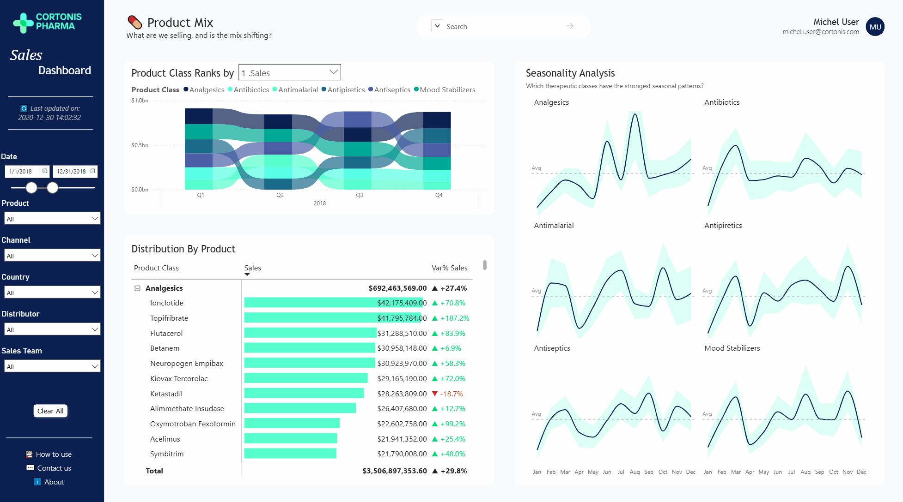
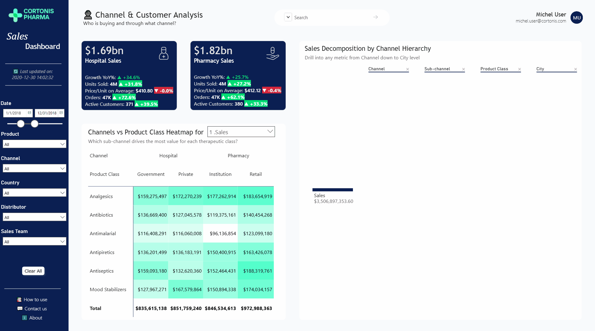
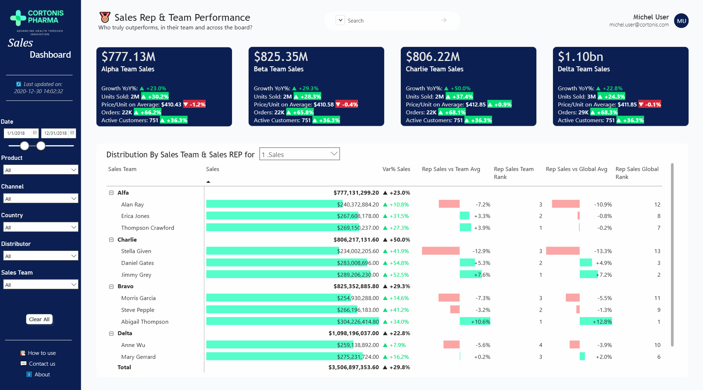

# 💊 Cortonis Pharma - Sales Performance Dashboard


## The Context

**Cortonis Pharma** is a fictional pharmaceutical company operating across Poland and Germany. The dataset covers 254,000 sales transactions across 4 years (2017–2020), including product-level detail, customer and distributor information, channel breakdown, geographic data, and sales team hierarchy.

The dashboard is designed for two audiences:
- **Sales leadership** - executive overview, trend monitoring, high-level KPIs
- **Territory and field managers** - granular performance by rep, territory, product, and channel

All pages were wireframed in **Figma** before development - wireframe images are embedded directly in the report as reference layers.

---

## Data Source

**Foresight - Pharmaceutical Manufacturing Company's Wholesale-Retail Data**
254,082 transactions · Poland & Germany · 2017–2020

| Field | Description |
|-------|-------------|
| `Distributor` | Wholesaler name |
| `Customer Name` | Pharmacy or hospital name |
| `City` / `Country` | Customer location |
| `Channel` | Hospital or Pharmacy |
| `Sub-channel` | Private, Retail, Institution, Government |
| `Product Name` | Drug name |
| `Product Class` | Therapeutic class (Antibiotics, Analgesics, Mood Stabilizers, Antiseptics, Antipyretics, Antimalarial) |
| `Quantity` / `Price` / `Sales` | Transaction volume and value |
| `Month` / `Year` | Transaction period |
| `Name of Sales Rep` | Rep who facilitated the sale |
| `Manager` / `Sales Team` | Team hierarchy (Alfa, Bravo, Charlie, Delta) |

> Note on Poland data: sales data for Poland is available for 2018 only. YoY variance indicators are intentionally hidden for Poland to avoid misleading comparisons.

---

## Page 1 - 🔎 Executive Overview

### What it answers
- How is the business performing overall - in sales, volume, orders, pricing, and customer count?
- Is performance improving or declining vs. the previous year?
- What does the sales trend look like across the year, and how does it vary by quarter?
- Which territories, products, channels, or teams are driving the most value?

### Screenshot


### KPI Cards

Five top-level metrics, each showing the current period value alongside the previous year's value and variance in both absolute and percentage terms (color-coded green/red):

| KPI | Measure |
|-----|---------|
| **Sales** | `1. Total_Sales` |
| **Units Sold** | `1. Total_Unit` |
| **Orders** | `1. Total_Order` |
| **Price / Unit on Average** | `1. Avg_Price/Unit` |
| **Customers** | `1. Active_Customers` |

Each card displays: current value · last year value (`2. Total_Sale_Last_Year`) · absolute variance · % variance (`4. Delta%_Total_Sales`). Showing both absolute and relative variance is a deliberate choice - on billion-dollar figures, a "-16%" means more when paired with "-$575.96M".

### Trend Line Chart - Current Year vs. Last Year

The chart overlays two series simultaneously:
- **Current period** - `1. Total_Sales`
- **Same period last year** - `2. Total_Sale_Last_Year`

A dropdown field parameter (`Executive Overview Parameter`) lets the user switch the displayed metric across all five KPIs. Switching updates both the trend chart and the distribution matrix simultaneously - a single selection drives the entire page.

### Distribution Matrix - Dual Field Parameters

**Parameter 1 - Metric** (`Executive Overview Parameter`): Sales, Units, Orders, Price/Unit, Customers

**Parameter 2 - Dimension** (`Dimension Categories`): switches the breakdown axis between:
- Locations (Country → Region → City)
- Product Class → Product
- Channel → Sub-channel
- Sales Team → Sales Rep

The matrix displays: absolute value · data bar · `4. Delta%_Total_Sales` (Var% YoY) - color-coded green/red.

### Search Bar

A cross-dimension text slicer on a concatenated `Search` column combining all key dimensions into a single searchable string per row.

### Slicers

Six synchronized slicers on the left sidebar:
`Date` · `Product Class / Product` · `Channel / Sub-channel` · `Country / Region / City` · `Distributor` · `Sales Team / Rep`

A **Clear All** button resets all slicers via a named bookmark.

### UX Details

- **Personalized greeting** - `USERPRINCIPALNAME()` renders the logged-in user's name and email
- **Date range slicer** - dual-handle slider with explicit start/end dates
- **Last updated timestamp** - displayed in the sidebar
- **Help links** - sidebar footer: How to use · Contact us · About
- **Custom navigation** - page buttons rather than native Power BI tabs
- **Tooltip pages** - hovering surfaces contextual detail
- **Author signature** - "Developed by Guillaume Pien"

---

## Page 2 - 🌍 Territory & Geographic Performance

### What it answers
- Where are we growing and where are we losing ground?
- How do Germany and Poland compare across all key metrics?
- Which regions and cities are the strongest performers - and which are declining?
- Which cities are high-volume but low-growth (defend), and which are low-volume but high-growth (accelerate)?

### Screenshot


### Country KPI Cards

Two dedicated cards - Germany and Poland - displaying all five metrics with YoY variance. Poland YoY indicators display "--" (2018 data only).

### Sales by Location Map

Bubble map (`map` visual) with `City` as location, `1. Total_Sales` as bubble size, switchable by `Executive Overview Parameter`.

### Distribution Matrix

Same dual field parameter architecture as Page 1. Defaults to Country → Region → City.

### Sales vs Growth YoY% per City - Quadrant Scatter Plot (`scatterChart`)

| Axis | Measure |
|------|---------|
| X | `1. Total_Sales` |
| Y | `5. Delta%_Total_Sales_NonFormatted` |
| Size | `1. Total_Unit` |
| X reference line | `Median Sales by Region` |
| Y reference line | `Median Growth by Region` |

**Quadrant logic - BCG Matrix framework:**

| Quadrant | Label | Strategic implication |
|----------|-------|----------------------|
| Top right | ⭐ Stars | Protect and invest |
| Top left | ❓ Question Marks | Evaluate and accelerate |
| Bottom right | 🐄 Cash Cows | Defend and harvest |
| Bottom left | 🐕 Dogs | Review and deprioritize |

Reference lines use dynamic DAX medians - recalculated on every filter change. Quadrant background colors (blue = growth zone, pink = decline zone) are applied via a custom legend image. Zoom sliders on both axes allow isolation of the dense city cluster.

---

## Page 3 - 💊 Product Mix

### What it answers
- What are we selling, and is the mix shifting across quarters?
- Which therapeutic classes drive the most revenue - and are they growing?
- Which classes have the strongest seasonal patterns, and when do they peak?

### Screenshot



### Product Class Ranks - Ribbon Chart (`ribbonChart`)

All 6 therapeutic classes ranked by quarter, piloted by `Executive Overview Parameter`. Ribbon crossings signal ranking changes between classes.

**Color convention:** coordinated blue/teal palette - green (`#03DE74`) and red (`#D7263D`) are excluded, reserved for variance indicators only.

| Class | Color |
|-------|-------|
| Analgesics | `#0B1F52` |
| Antibiotics | `#58FFE6` |
| Antimalarial | `#55FFCC` |
| Antiseptics | `#1A6B8A` |
| Antipiretics | `#4B5EA6` |
| Mood Stabilizers | `#00A896` |

### Distribution By Product - Matrix (`pivotTable`)

`Product Class → Product Name` hierarchy, same dual field parameter as all other pages.

### Seasonality Analysis - Small Multiples (`lineChart`)

| Role | Measure / Field |
|------|----------------|
| X axis | `MonthName` |
| Small multiples | `Product Class` |
| Main line | `Seasonality_Index` |
| Upper band | `Seasonality_Upper_95` |
| Lower band | `Seasonality_Lower_95` |

**Seasonality Index:** `Monthly Total / Average Monthly Total (annual)` - normalized so all classes are comparable regardless of absolute volume. Reference line at Y=1.0 materializes the annual average baseline.

**95% Confidence Intervals:** `Index ± 1.96 × (StdDev / √N)` where StdDev is the dispersion across products within the class for that month.

**Seasonal patterns:**

| Class | Peak | Interpretation |
|-------|------|----------------|
| Analgesics | Jun–Aug | Estival - sports injuries, outdoor activity |
| Antibiotics | Jan–Feb | Winter - respiratory infections |
| Antimalarial | Apr & Oct | Two peaks - travel seasons |
| Antipiretics | Feb & Nov | Winter - fever and infections |
| Antiseptics | Flat | Low seasonality - regular year-round usage |
| Mood Stabilizers | Complex | Consistent with seasonal depression literature |

---

## Page 4 - 👤 Channel & Customer Analysis

### What it answers
- Who is buying and through what channel?
- How do Hospital and Pharmacy compare across all key metrics?
- Which sub-channel drives the most value for each therapeutic class?
- Where does revenue concentrate when drilling from channel down to city level?

### Screenshot



### Channel KPI Cards

Two cards - Hospital and Pharmacy - with all five metrics and full YoY variance. Same measure set as all other cards (`1. Total_Sales`, `4. Delta%_Total_Sales`, etc.).

### Channels vs Product Class Heatmap (`pivotTable`)

A matrix visual crossing **Channel × Sub-channel** against **Product Class**, displaying `1. Total_Sales` with conditional color formatting - gradient from light to dark by relative value within each column.

Fields: `Channel · Sub-channel · Product Class` × `Executive Overview Parameter` metric

**Sub-title:** *"Which sub-channel drives the most value for each therapeutic class?"*

### Sales Decomposition by Channel Hierarchy (`decompositionTreeVisual`)

Drill-down hierarchy:
```
1. Total_Sales → Channel → Sub-channel → Product Class → City
```

Piloted by `Executive Overview Parameter` - the metric switches dynamically. The user drills through each level by clicking, with each branch showing the absolute contribution to the parent node.

**Sub-title:** *"Drill into any metric from Channel down to City level"*

---

## Page 5 - 🥇 Sales Rep & Team Performance

### What it answers
- Who truly outperforms - in their team and across the board?
- Which teams are driving the most revenue, and at what growth rate?
- Is a rep's performance driven by genuine skill or by territory advantage?

### Screenshot



### Team KPI Cards

Four cards - Alpha, Beta, Charlie, Delta - with all five metrics and YoY variance. Same measure set as all other cards.

| Team | Sales | Growth YoY |
|------|-------|------------|
| Alpha | $777.13M | ▲ +23.0% |
| Beta | $825.35M | ▲ +29.3% |
| Charlie | $806.22M | ▲ +50.0% |
| Delta | $1.10bn | ▲ +22.8% |

### Distribution By Sales Team & Sales Rep (`pivotTable`)

`Sales Team → Name of Sales Rep` hierarchy with six performance columns, all piloted by `Executive Overview Parameter`:

| Column | Measure | Description |
|--------|---------|-------------|
| Sales / Units | `1. Total_Sales` / `1. Total_Unit` | Absolute value + data bar + Var% YoY |
| vs Team Avg | `6. Total_Unit_Rep_vs_TeamAvg` | % deviation from rep's own team average |
| Team Rank | `7. Total_Unit_Rep_Rank_InTeam` | Rank within the rep's team |
| vs Global Avg | `8. Total_Unit_Rep_vs_GlobalAvg_Sales` | % deviation from all-rep average |
| Global Rank | `9. Total_Units_Rep_Rank_Global` | Rank across all reps company-wide |

**Why two ranking dimensions matter**

A raw sales ranking is misleading - a rep covering a major city will structurally outsell a rural rep regardless of skill. The dual ranking separates **absolute performance** (Global Rank) from **contextual performance** (Team Rank + vs Team Avg):

- High global + high team rank → genuine top performer
- High global + low team rank → strong territory, weaker relative performance
- Low global + high team rank → strong performer in a weaker territory

**Example:** Abigail Thompson (Bravo) is #1 in her team (+10.6% vs team avg) AND #1 globally (+12.8% vs global avg). Alan Ray (Alfa) is #3 in his team (-7.2%) and #12 globally (-10.9%) - structurally disadvantaged or underperforming.

**Key DAX patterns**

`ISINSCOPE` suppresses subtotals. `SUM > 0` guard prevents phantom rows for reps outside their actual team. `ALL(Dim_Sales_Team)` breaks the team filter context for global measures:

```dax
Rep_Rank_Global =
IF(
    ISINSCOPE(Fact_Sales[Name of Sales Rep]) &&
    CALCULATE(SUM(Fact_Sales[Sales])) > 0,
    VAR CurrentRepSales = CALCULATE(SUM(Fact_Sales[Sales]))
    VAR AllRepsSales =
        CALCULATETABLE(
            ADDCOLUMNS(
                ALL(Fact_Sales[Name of Sales Rep]),
                "RepSales",
                CALCULATE(SUM(Fact_Sales[Sales]), ALL(Dim_Sales_Team))
            ),
            ALL(Dim_Sales_Team)
        )
    RETURN
        COUNTROWS(FILTER(AllRepsSales, [RepSales] > CurrentRepSales)) + 1,
    BLANK()
)
```

```dax
Rep_vs_TeamAvg =
IF(
    ISINSCOPE(Fact_Sales[Name of Sales Rep]) &&
    CALCULATE(SUM(Fact_Sales[Sales])) > 0,
    VAR CurrentTeam = MAX(Fact_Sales[Sales Team])
    VAR RepSales = CALCULATE(SUM(Fact_Sales[Sales]))
    VAR TeamAvg =
        CALCULATE(
            AVERAGEX(
                VALUES(Fact_Sales[Name of Sales Rep]),
                CALCULATE(SUM(Fact_Sales[Sales]))
            ),
            ALL(Fact_Sales[Name of Sales Rep]),
            Fact_Sales[Sales Team] = CurrentTeam
        )
    RETURN DIVIDE(RepSales - TeamAvg, TeamAvg),
    BLANK()
)
```

---

## Design Approach

**Wireframe-first:** Every page was designed in Figma before any Power BI development. Wireframe images are embedded directly in the `.pbix` file as reference layers - layout, color, hierarchy, and slicer placement were all locked before touching the tool.

**Why UX matters in BI**

Users today are surrounded by polished consumer apps. When an internal tool doesn't meet that standard, adoption suffers - not because the data is wrong, but because people don't have time to relearn navigation. This dashboard is built to feel as intuitive as the apps people already use daily: consistent navigation, clear visual hierarchy, and each page designed for a specific audience and a single analytical question.

**Typography**

| Role | Font |
|------|------|
| Titles & headers | Trebuchet MS |
| Body & data labels | Segoe UI |

**Color palette**

| Color | Hex | Semantic role |
|-------|-----|---------------|
| Emerald Green | `#03DE74` | Positive variance only |
| Navy | `#0B1F52` | Sidebar, primary dark elements |
| Cyan | `#58FFE6` | Data bars, chart fills |
| Mint | `#55FFCC` | Secondary accent |
| Red | `#D7263D` | Negative variance only |

Green and red are reserved exclusively for variance indicators - never used decoratively.

**Additional colors for therapeutic class ribbon chart:**

| Class | Hex |
|-------|-----|
| Antiseptics | `#1A6B8A` |
| Antipiretics | `#4B5EA6` |
| Mood Stabilizers | `#00A896` |

---

## Key DAX Measures

**YoY variance**
```dax
4. Delta%_Total_Sales =
VAR CurrentSales = [1. Total_Sales]
VAR PreviousSales = [2. Total_Sale_Last_Year]
RETURN DIVIDE(CurrentSales - PreviousSales, PreviousSales)
```

**Dynamic median for scatter quadrant**
```dax
Median Sales by Region =
MEDIANX(VALUES(Fact_Sales[City]), CALCULATE([1. Total_Sales]))
```

**Seasonality Index**
```dax
Seasonality_Index =
VAR TotalThisMonth =
    CALCULATE(
        SUM(Fact_Sales[Sales]),
        REMOVEFILTERS('Calendar'[Date]),
        REMOVEFILTERS('Calendar'[Year]),
        REMOVEFILTERS('Calendar'[MonthName])
    )
VAR TotalAllYear =
    CALCULATE(SUM(Fact_Sales[Sales]), REMOVEFILTERS('Calendar'))
VAR NbMonths =
    CALCULATE(DISTINCTCOUNT('Calendar'[Month Number]), REMOVEFILTERS('Calendar'))
RETURN
    DIVIDE(TotalThisMonth, DIVIDE(TotalAllYear, NbMonths))
```

**Seasonality 95% CI**
```dax
Seasonality_Upper_95 =
VAR AvgIndex = [Seasonality_Index]
VAR StdDev =
    CALCULATE(
        STDEVX.P(VALUES(Fact_Sales[Product Name]), CALCULATE([Seasonality_Index])),
        REMOVEFILTERS('Calendar'[Date]),
        REMOVEFILTERS('Calendar'[Year]),
        REMOVEFILTERS('Calendar'[MonthName])
    )
VAR N =
    CALCULATE(
        DISTINCTCOUNT(Fact_Sales[Product Name]),
        REMOVEFILTERS('Calendar'[Date]),
        REMOVEFILTERS('Calendar'[Year]),
        REMOVEFILTERS('Calendar'[MonthName])
    )
RETURN AvgIndex + 1.96 * DIVIDE(StdDev, SQRT(N))
```

---

## Files

| File | Description |
|------|-------------|
| `Pharma_Sales_Dashboard_V0_1.pbix` | Full Power BI report with embedded Figma wireframes |
| `Screenshots/` | GIF walkthroughs of each dashboard page |

---

## Data Source

**Foresight - Pharmaceutical Manufacturing Company's Wholesale-Retail Data**
[https://foresightbi.com.ng/practice-data/3-datasets-for-your-portfolio/](https://foresightbi.com.ng/practice-data/3-datasets-for-your-portfolio/)

---

*Built as Project 1 of a two-part pharma commercial analytics series. [Project 2](https://github.com/gpn64/pharma-sales-analytics) extends the analysis with Python-based customer segmentation, territory underperformance modeling, and sales forecasting.*
