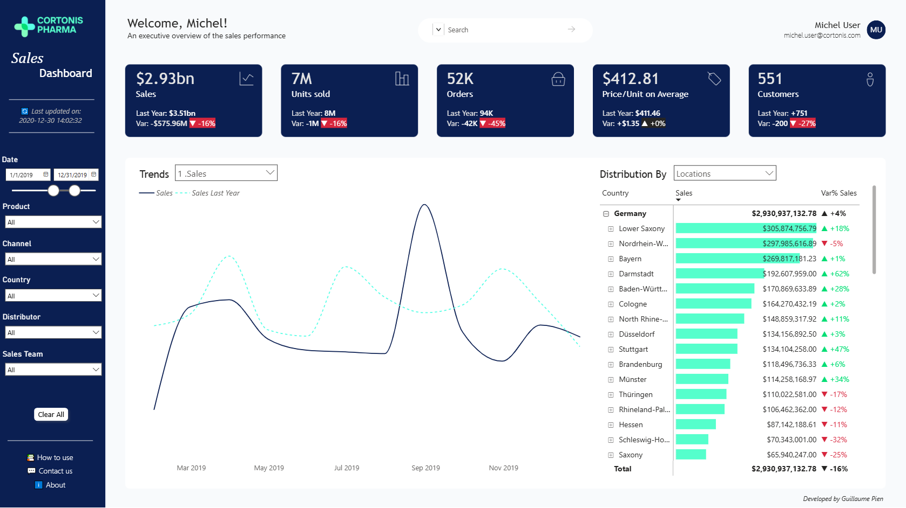
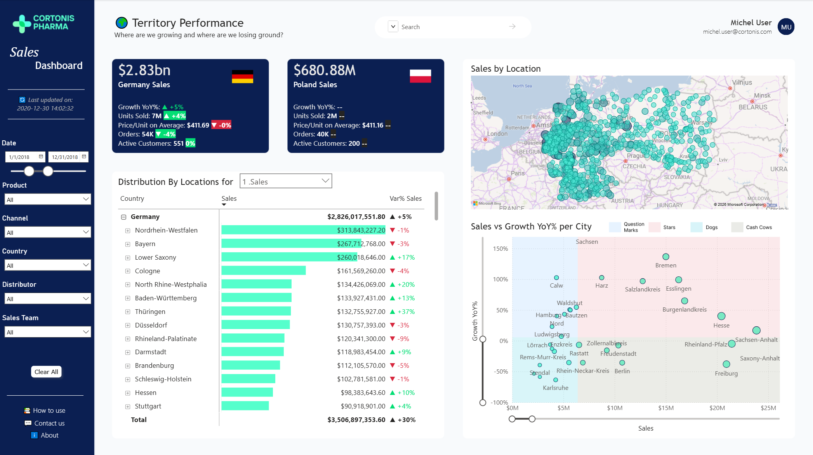

# 💊 Cortonis Pharma — Sales Performance Dashboard


> A commercial performance dashboard for a fictional pharmaceutical company — built to answer the questions a sales manager actually asks, with a UX-first approach from Figma wireframe to deployed report.

---

## Status

| Page | Status |
|------|--------|
| Executive Overview | ✅ Complete |
| Territory & Geographic Performance | ✅ Complete |
| Product & Therapeutic Class | 🔄 In progress |
| Channel & Customer Analysis | 🔄 In progress |
| Sales Rep & Team Performance | 🔄 In progress |

---

## The Context

**Cortonis Pharma** is a fictional pharmaceutical company operating across Poland and Germany. The dataset covers 254,000 sales transactions across 4 years (2017–2020), including product-level detail, customer and distributor information, channel breakdown, geographic data, and sales team hierarchy.

The dashboard is designed for two audiences:
- **Sales leadership** — executive overview, trend monitoring, high-level KPIs
- **Territory and field managers** — granular performance by rep, territory, product, and channel

---

## Data Source

**Foresight — Pharmaceutical Manufacturing Company's Wholesale-Retail Data**
254,082 transactions · Poland & Germany · 2017–2020

| Field | Description |
|-------|-------------|
| `Distributor` | Wholesaler name |
| `Customer Name` | Pharmacy or hospital name |
| `City` / `Country` | Customer location |
| `Channel` | Hospital or Pharmacy |
| `Sub-channel` | Private, Retail, Institution, Government |
| `Product Name` | Drug name |
| `Product Class` | Therapeutic class (Antibiotics, Analgesics, Mood Stabilizers, Antiseptics, Antipyretics, Antimalarial) |
| `Quantity` / `Price` / `Sales` | Transaction volume and value |
| `Month` / `Year` | Transaction period |
| `Name of Sales Rep` | Rep who facilitated the sale |
| `Manager` / `Sales Team` | Team hierarchy (Alfa, Bravo, Charlie, Delta) |

> Note on Poland data: sales data for Poland is available for 2018 only. YoY variance indicators are intentionally hidden for Poland to avoid misleading comparisons.

---

## Page 1 — Executive Overview

### What it answers
- How is the business performing overall — in sales, volume, orders, pricing, and customer count?
- Is performance improving or declining vs. the previous year?
- What does the sales trend look like across the year, and how does it vary by quarter?
- Which territories, products, channels, or teams are driving the most value?

### Screenshot



### KPI Cards

Five top-level metrics, each showing the current period value alongside both the previous year's absolute value and the variance in absolute and percentage terms (color-coded green/red):

| KPI | Description |
|-----|-------------|
| **Sales** | Total revenue for the selected period |
| **Units Sold** | Total quantity sold |
| **Orders** | Number of distinct transactions |
| **Price / Unit on Average** | Average selling price per unit |
| **Customers** | Number of distinct active customers |

Each card displays: current value · last year value · absolute variance · % variance. Showing both absolute and relative variance is a deliberate choice — on billion-dollar figures, a "-16%" means more when paired with "-$575.96M". YoY variance adapts automatically to the selected period using `PARALLELPERIOD` DAX logic.

### Trend Chart — Current Year vs. Last Year + Field Parameter (Metric)

The chart overlays two series simultaneously — current period and same period last year — making period-over-period trends immediately visible without any additional interaction. A dropdown field parameter lets the user switch the displayed metric across all five KPIs:

```
Sales → Units Sold → Orders → Price/Unit → Customers
```

Switching the metric updates both the trend chart and the distribution matrix simultaneously — a single selection drives the entire page.

### Distribution Matrix — Dual Field Parameters

The matrix on the right provides a ranked breakdown of the selected metric. It uses **two independent field parameters**:

**Parameter 1 — Metric** (shared with the trend chart)
Switches the value column between Sales, Units Sold, Orders, Price/Unit, and Customers.

**Parameter 2 — Dimension**
A dropdown switches the breakdown axis between:
- Locations (Country → Region)
- Product Class → Product
- Channel → Sub-channel
- Sales Team → Sales Rep

The matrix displays three columns: the absolute value, a data bar for visual ranking, and a **Var% vs. Last Year** column — color-coded green/red — so performance context is visible directly in the breakdown without needing a separate visual.

This dual-parameter architecture means the user can explore any metric across any dimension from a single page — without navigating away or duplicating report pages.

### Search Bar

A cross-dimension search bar filters the entire page by matching against a concatenated column that combines Channel, Sub-channel, Country, City, Product Class, Product Name, Sales Team, and Manager into a single searchable string per row.

### Slicers

Six synchronized slicers on the left sidebar filter all visuals simultaneously:

`Date` · `Product` · `Channel` · `Country` · `Distributor` · `Sales Team`

A **Clear All** button resets all slicers via a named bookmark — one click returns the page to its default state.

### UX Details

- **Personalized greeting** — `USERPRINCIPALNAME()` renders the logged-in user's name and email in the top-right header
- **Date range slicer** — a dual-handle slider with explicit start/end dates gives precise period control
- **Last updated timestamp** — displayed in the sidebar for data governance transparency
- **Help links** — sidebar footer includes How to use, Contact us, and About
- **Custom navigation** — page navigation via buttons rather than native Power BI tabs
- **Tooltip pages** — hovering over KPI cards and chart data points surfaces a custom tooltip page with contextual detail
- **Author signature** — "Developed by Guillaume Pien" displayed in the report footer

---

## Page 2 — Territory & Geographic Performance

### What it answers
- Where are we growing and where are we losing ground?
- How do Germany and Poland compare across all key metrics?
- Which regions and cities are the strongest performers — and which are declining?
- Which cities are high-volume but low-growth (defend), and which are low-volume but high-growth (accelerate)?

### Screenshot



### Country KPI Cards

Two dedicated cards — one per market — display all five metrics side by side for an immediate Germany vs. Poland comparison:

| Metric | Germany | Poland |
|--------|---------|--------|
| Sales | ✅ with YoY variance | ✅ (no YoY — 2018 only) |
| Units Sold | ✅ with YoY variance | ✅ |
| Price / Unit | ✅ with YoY variance | ✅ |
| Orders | ✅ with YoY variance | ✅ |
| Active Customers | ✅ with YoY variance | ✅ |

YoY variance indicators are suppressed for Poland where prior-year data is unavailable — displaying "--" rather than a misleading 0% or blank.

### Sales by Location Map

Bubble map showing sales volume by city across Poland and Germany. Bubble size is proportional to sales — the spatial distribution of revenue is immediately visible, with Germany showing significantly higher density and concentration than Poland.

### Distribution Matrix

Same dual field parameter architecture as Page 1 — metric and dimension both switchable independently. Defaults to Locations (Country → Region) with Sales and Var% Sales.

### Sales vs Growth YoY% per City — Quadrant Scatter Plot

The analytical centrepiece of this page. Each bubble represents a city, plotted on:
- **X axis** — absolute Sales volume
- **Y axis** — YoY Growth %

**Quadrant logic — BCG Matrix framework:**

| Quadrant | Sales | Growth | Label | Strategic implication |
|----------|-------|--------|-------|----------------------|
| Top right | High | High | ⭐ Stars | Protect and invest |
| Top left | Low | High | ❓ Question Marks | Evaluate and accelerate |
| Bottom right | High | Low | 🐄 Cash Cows | Defend and harvest |
| Bottom left | Low | Low | 🐕 Dogs | Review and deprioritize |

**Key technical details:**
- Quadrant dividers are **dynamic median lines** — recalculated via DAX `MEDIANX` each time a filter is applied. When the user filters by Sales Team or Product, the medians shift to reflect that subset, keeping the quadrant analysis contextually relevant
- Quadrant background colors (blue = positive, pink = negative zones) make the four segments immediately readable without requiring the user to interpret axis values
- **Zoom sliders** on both axes allow the user to isolate the dense city cluster in the $0–$10M range without losing the outliers visible at full scale
- Quadrant labels (Stars, Question Marks, Dogs, Cash Cows) are displayed in the chart legend using BCG Matrix terminology — familiar to any commercial audience

---

## Design Approach

The dashboard was **wireframed in Figma** before any Power BI development began. Layout, navigation flow, color palette, KPI card structure, and slicer placement were all defined at the wireframe stage — ensuring design decisions were intentional rather than reactive.

**Why UX matters in BI**

Users today are surrounded by polished consumer apps and websites. When a new internal tool doesn't meet that same standard of experience, adoption suffers — not because the data is wrong, but because people don't have time to relearn how to navigate yet another unfamiliar interface.

This dashboard is built on the premise that a BI report should feel as intuitive as the apps people already use daily. That means consistent navigation, a clear visual hierarchy, and — critically — each page designed around a single audience and a single question. A field manager shouldn't have to scroll past executive-level content to find their territory data. A sales leader shouldn't be overwhelmed by rep-level detail on a summary page. When the right information reaches the right person without friction, adoption follows naturally.

**Typography**

| Role | Font |
|------|------|
| Titles & headers | Trebuchet MS |
| Body & data labels | Segoe UI |

**Color palette**

| Color | Hex | Usage |
|-------|-----|-------|
| Emerald Green | `#03DE74` | Positive variance, growth indicators |
| Navy | `#0B1F52` | Sidebar background, primary dark elements |
| Cyan | `#58FFE6` | Data bars, chart fills, accent visuals |
| Mint | `#55FFCC` | Secondary accent |
| Red | `#D7263D` | Negative variance, decline indicators |

The palette is intentionally tight — two neutrals (navy, white) and three accent colors with clear semantic roles. Green and red are reserved exclusively for variance indicators; cyan and mint handle all data visualization. This avoids the common mistake of using color decoratively, which creates visual noise without adding information.

**Design principles applied:**
- Defined color semantics — every color has a single purpose and never appears outside that role
- One question per page — each page has a defined analytical purpose and a defined audience
- App-like experience — custom button navigation, personalized header, feedback footer
- Information density calibrated by audience — executive page prioritizes scannable KPIs; detail pages support deeper exploration

---

## Key DAX Measures

**Dynamic YoY variance**
```dax
Sales YoY % =
VAR CurrentSales = [Total Sales]
VAR PreviousSales =
    CALCULATE(
        [Total Sales],
        PARALLELPERIOD('Calendar'[Date], -1, YEAR)
    )
RETURN
    DIVIDE(CurrentSales - PreviousSales, PreviousSales)
```

**Dynamic median for scatter quadrant lines**
```dax
Median Sales =
MEDIANX(
    VALUES(Data[City]),
    CALCULATE([Total Sales])
)
```

**Germany Sales (country-filtered)**
```dax
Germany Sales =
CALCULATE([Total Sales], Data[Country] = "Germany")
```

**Customers (distinct count)**
```dax
Customers =
DISTINCTCOUNT(Data[Customer Name])
```

**Average Price per Unit**
```dax
Avg Price per Unit =
DIVIDE([Total Sales], [Total Units])
```

---

## Files

| File | Description |
|------|-------------|
| `Pharma_Sales_Dashboard_V0_1.pbix` | Power BI report file |
| `Screenshots/` | Dashboard page screenshots |

---

## Data Source

**Foresight — Pharmaceutical Manufacturing Company's Wholesale-Retail Data**
[https://foresightbi.com.ng/practice-data/3-datasets-for-your-portfolio/](https://foresightbi.com.ng/practice-data/3-datasets-for-your-portfolio/)

---

*Built as Project 1 of a two-part pharma commercial analytics series. [Project 2](https://github.com/gpn64/pharma-sales-analytics) extends the analysis with Python-based customer segmentation, territory underperformance modeling, and sales forecasting.*
